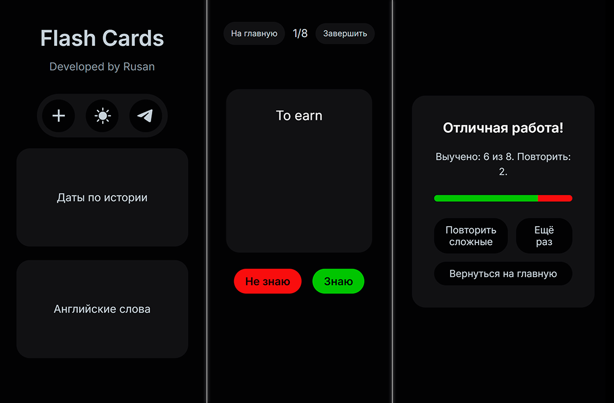

<div align="center">

# Flash Cards

[](https://developer.mozilla.org/en-US/docs/Web/Guide/HTML/HTML5)
[](https://developer.mozilla.org/en-US/docs/Web/CSS)
[](https://developer.mozilla.org/en-US/docs/Web/JavaScript)

This is a web application for learning anything with flashcards. It allows users to create sets of cards, add words or phrases to them, and then practice memorizing them.

</div>

---

<div align="center">

## 📊 **Demonstration**


*Screenshots from a mobile device*

</div>

---

## ✨ Features

- **Create sets:** Create an unlimited number of card sets on different topics.
- **Manage cards:** Add, edit, and delete cards in each set.
- **Practice mode:** Take tests to memorize cards. The application tracks which cards you know and which ones you need to repeat.
- **Results:** View statistics at the end of each session, including the number of learned and difficult cards.
- **Repeat difficult cards:** A special mode for practicing only those cards that caused you difficulty.
- **Personalization:**
    - **Dark and light themes:** Switch between themes for comfortable use at any time of the day.
    - **Grid or list view:** Choose how to display card sets on the main page.
- **Local storage:** All your data is saved in your browser's `localStorage`, so you won't lose it when you reload the page.

---

## 📂 File structure

```
- `index.html`: The main page with a list of card sets.
- `practice.html`: The page for practicing.
- `results.html`: The page with the results of the last session.
- `css/style.css`: The main styles of the application.
- `js/`: The folder with JavaScript files:
    - `main.js`: The main logic for the main page (creating/editing sets, managing the interface).
    - `storage.js`: A module for working with `localStorage` (saving, loading, updating data).
    - `practice.js`: The logic for the practice page (displaying cards, tracking progress).
    - `results.js`: The logic for the results page.
- 'assets/': The folder with sources files:
    - 'icon.svg'
    - 'preview.png'
```